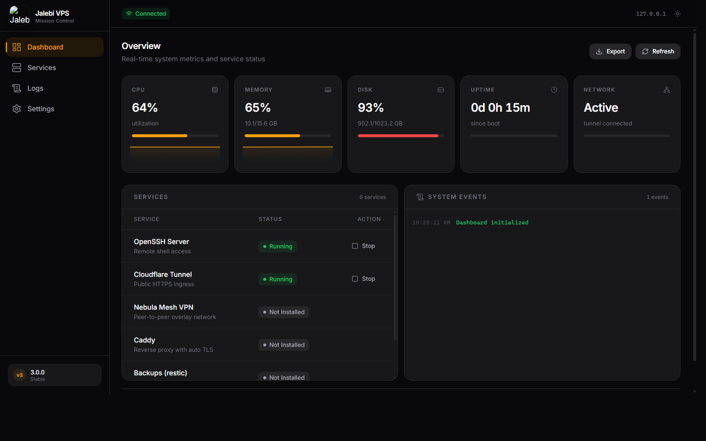
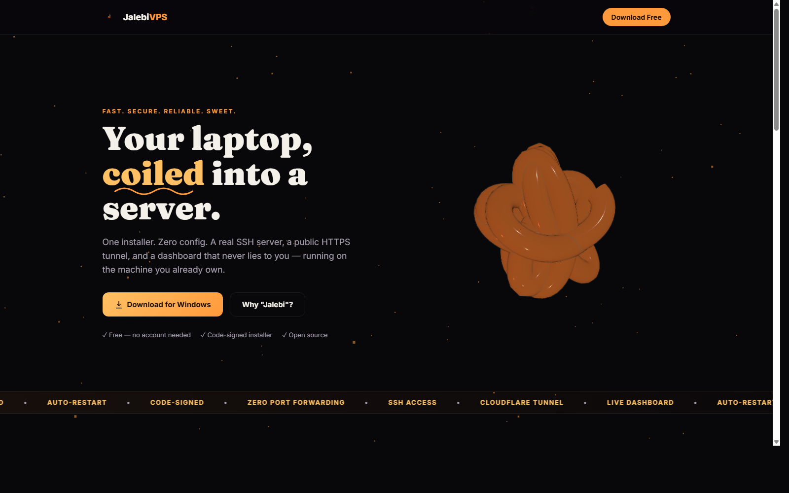

# JALEBI VPS

Turn any Windows laptop into a production-ready VPS with one click.




**🍥 Landing page:** [jalebi-vps.web.app](https://jalebi-vps.web.app) — a 3D landing page (Three.js) with a
procedurally-generated jalebi coil, "why the name" explainer, and a download button. Source in
[`jalebi-landing/`](jalebi-landing/), deployed via `firebase deploy`.



## Overview

JALEBI VPS transforms Windows machines into secure, accessible virtual servers using:
- **OpenSSH Server** for remote shell access
- **Cloudflare Tunnel** for public HTTPS URLs (zero open firewall ports)
- **Web-based Management Dashboard** for real-time monitoring
- **Auto-start Configuration** for persistence across reboots
- **Subscription & Payment System** via Razorpay

## Features

- **Zero-Configuration Public Access**: Access your Windows machine via SSH and HTTPS from anywhere
- **Military-Grade Security**: All traffic encrypted through Cloudflare Tunnel — zero inbound firewall rules required
- **Real-Time Dashboard**: React-powered dashboard with live CPU, memory, disk, uptime, and service status
- **One-Click Installation**: Automated MSI installer via WiX v7 — provisions everything in minutes
- **Persistent Operation**: Runs as a Windows service via WinSW, survives reboots with auto-start
- **Code-Signed Installer**: Self-signed MSI with CI pipeline that can use real certificates
- **Honest status reporting**: services that aren't installed show "Not Installed" — never a fake "Running" badge

## Quick Start

1. Download `JalebiVPS-v3.0.0.msi` from the [releases page](https://github.com/varshinicb1/Parakram-leads/releases)
2. Run the MSI as Administrator
3. The installer provisions:
   - OpenSSH Server (installs + configures Windows capability)
   - Cloudflare Tunnel binary (bundled `cloudflared.exe`)
   - Management Dashboard (React + Express on port 9876)
   - Windows service (`JalebiVPS`) for automatic startup
   - Firewall rules (ports 22, 9876)
4. Access your VPS:
   - **Dashboard**: http://localhost:9876
   - **SSH**: `ssh %USERNAME%@localhost`
   - **Public URL**: After configuring a Cloudflare Tunnel token

## Architecture

```
Windows Laptop
    │
    ├── OpenSSH Server     ← Remote shell (ssh user@tunnel-url)
    ├── Cloudflare Tunnel  ← Public *.getparakram.in URL, zero open ports
    ├── Web Dashboard      ← React + Express on port 9876
    ├── WinSW Service      ← Windows service wrapping Node.js backend
    └── Auto-start on boot ← Windows service + Task Scheduler
```

## Subscription Plans (planned pricing — not yet wired into the installer)

| Tier | Price/Month | Features |
|------|-------------|----------|
| **Free** | $0 | 1 VPS tunnel, basic dashboard, manual tunnel setup |
| **Edge** | $9 | 5 VPS, custom domain, auto-tunnel setup, priority support |
| **Fleet** | $49 | Unlimited VPS, API access, team management, SLA |

The backend has Razorpay + subscription routes (`vps_subscription`) and Google Sign-In (`auth.py`),
but nothing in this installer or dashboard calls them yet — there's no account creation, sign-in,
or payment flow in the MSI today. Table above is the target pricing, not a live feature.

## Technology Stack

| Component | Technology |
|-----------|-----------|
| **Installer** | WiX v7 MSI (`.msi`, ~40 MB) |
| **Dashboard Frontend** | React 19 + Vite + Tailwind CSS v4 + Radix UI |
| **Dashboard Backend** | Node.js + Express 5 (TypeScript) |
| **Service Management** | WinSW (Windows Service Wrapper) |
| **Tunnel** | Cloudflare Tunnel (bundled `cloudflared.exe`) |
| **Remote Access** | OpenSSH Server (Windows capability) |
| **Subscription** | Razorpay API (UPI, cards, netbanking) |
| **Install Scripts** | PowerShell 7+ |
| **CI/CD** | GitHub Actions + GitHub Container Registry |

## Known Limitations

1. **Caddy, Nebula, restic, Leads hosting not yet in MSI** — these were in the Python prototype but not yet ported to the v3 MSI (dashboard shows them as unavailable)
2. **Cloudflare Tunnel token** must be manually configured — no UI for entering a token yet
3. **Certificate is self-signed** — SmartScreen may warn on download. Upgrade path: Azure Trusted Signing (~$10/mo) or OV cert
4. **Windows OpenSSH capability** requires Windows Update connectivity on machines where it isn't cached
5. **Auto-update** is a placeholder — `/a/update-check` always returns `{available: false}`
6. **No installer wizard, account creation, or Google Sign-In flow in the MSI/dashboard** — install is silent; auth exists server-side for the Leads product only
7. **No release has been published yet.** CI (`vps-release.yml`) builds, signs, and smoke-tests the MSI on every `v*` tag, but the first clean run through the full pipeline is still in progress — check the [Actions tab](https://github.com/varshinicb1/Parakram-leads/actions/workflows/vps-release.yml) or [Releases page](https://github.com/varshinicb1/Parakram-leads/releases) for current status before assuming a download is available
8. **Uninstall can rarely leave an empty top-level install folder** due to a Windows file-handle-release race right after the service process exits (all files/services/firewall rules are removed regardless — only a harmless empty directory can remain). A retry-based cleanup step is in place; if you see a leftover empty `C:\Program Files\JalebiVPS`, it's safe to delete manually

## Development

### Prerequisites
- Windows 10/11 (64-bit)
- WiX v7 toolset
- Node.js 22+
- PowerShell 7+

### Dashboard (Dev Mode)
```powershell
cd windows-vps/dashboard
npm install
npm run dev          # Vite dev server (frontend)
npm run dev:server   # Express backend on :9877
npm run dev:all      # Both concurrently
```

### Building the MSI
```powershell
cd windows-vps
.\build.ps1          # Downloads dependencies, builds frontend, bundles backend, runs WiX
# Output: dist\JalebiVPS.msi (~40 MB)
```

### Manual WiX Build (after `build.ps1` populated `dist/`)
```powershell
wix build wix\JalebiVPS.wxs wix\GeneratedFiles.wxs -out dist\JalebiVPS.msi -bindpath dashboard\dist -arch x64
```

### Install / Uninstall
```powershell
msiexec /i dist\JalebiVPS.msi /qn
sc query JalebiVPS                            # Should show RUNNING
curl http://127.0.0.1:9876/a/s                   # Should return JSON stats
msiexec /x dist\JalebiVPS.msi /qn              # Clean removal
```

### Debug Logs
| Log | Location |
|-----|----------|
| MSI verbose | `%TEMP%\pvps.log` (use `/l*v`) |
| Service install | `%ProgramData%\JalebiVPS\install-service.log` |
| Provisioning | `%ProgramData%\JalebiVPS\provision.log` |
| Node.js stderr | `C:\Program Files\JalebiVPS\dashboard\JalebiVPS-svc.err.log` |

## CI/CD

The `vps-release.yml` workflow (triggered by `v*` tags or manual dispatch):
1. Builds the MSI
2. Code-signs it (secrets: `VPS_CODESIGN_PFX_BASE64` + `VPS_CODESIGN_PASSWORD`)
3. Runs a silent install → verify → uninstall smoke test
4. Publishes a GitHub Release with the MSI, Linux tarball, and SHA256 checksums

[](https://github.com/varshinicb1/Parakram-leads/actions/workflows/vps-release.yml)

## License

MIT License

## Contact

- **Email**: cbvarshini1@gmail.com
- **WhatsApp**: +91 7259426670

---

*Part of the Parakram Suite — Autonomous lead discovery, AI-powered scoring, and multi-channel outreach — unified in one premium platform.*
